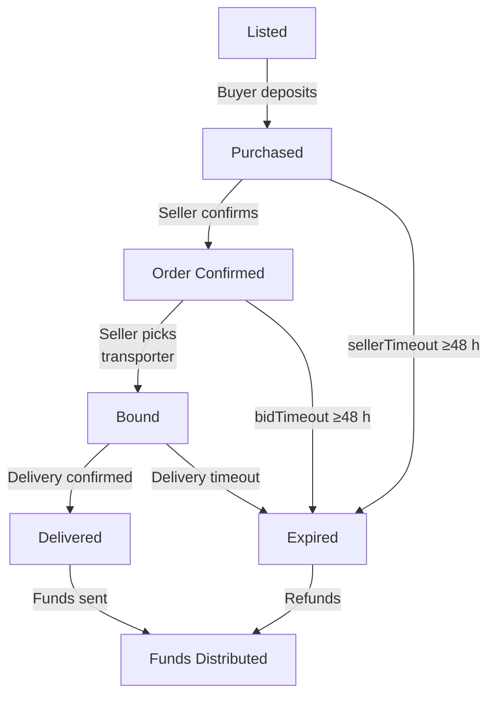
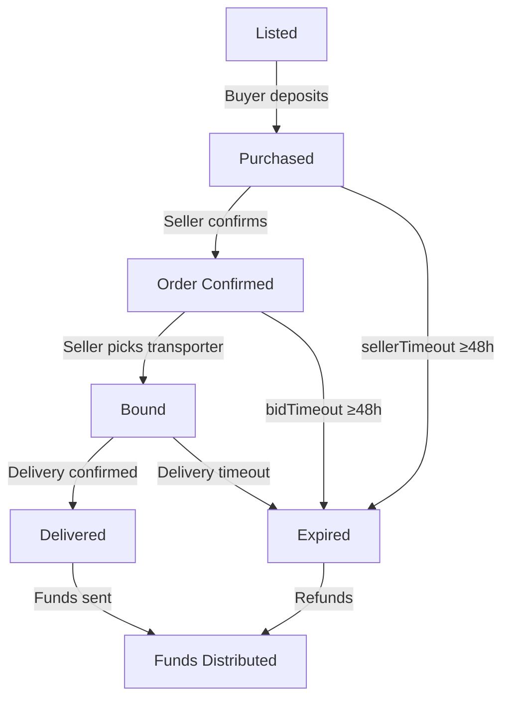

# EV Battery Supply Chain Escrow Smart Contract System


## Table of Contents
- [Overview](#overview)
- [Architecture](#architecture)
- [Key Features](#key-features)
- [Security and Robustness](#security-and-robustness)
- [Testing](#testing)
- [Usage](#usage)
- [Scientific/Research Value](#scientificresearch-value)
- [Diagrams](#diagrams)
- [References](#references)
- [Future Work](#future-work)
- [How to Run Tests](#how-to-run-tests)
- [NatSpec Comments and API Docs](#natspec-comments-and-api-docs)
- [Exporting Diagrams for Research Reports](#exporting-diagrams-for-research-reports)

---

# Legacy System Overview

This section summarizes the original design of the EV Battery Supplychain Escrow Smart Contract System, as described in `SC_System.txt`. It is preserved here for historical context and comparison with the current, more advanced system.

---

**Overview**
This project implements a robust, modular, and secure set of smart contracts for supply chain scenarios (e.g., EV battery trade). The system manages confidential buyer deposits, seller and transporter roles, delivery verification, cancellation, refund, timeout logic, and scalable product creation. All contracts are thoroughly tested for edge cases and race conditions.

**Key Features**
1. **Phased Escrow State Machine**
   - Phases: Listed → Funded → Bid → Bound → Delivery → Delivered → Cancelled → Expired
   - Transitions are strictly enforced, ensuring only valid actions at each stage.

2. **Confidential Commitments**
   - Buyer and product prices are handled as confidential commitments (hashes), supporting privacy and future ZKP integration.

3. **Buyer Deposit & Refunds**
   - Buyer deposits Ether into escrow after contract creation.
   - Deposit is tracked and can be refunded or withdrawn based on contract outcome.
   - Buyer can cancel and get a refund if the deal is not completed and the deadline has passed.
   - Refunds are handled securely, with events emitted for transparency.

4. **Transporter Bidding & Security**
   - Transporters can register and set a delivery fee.
   - Seller selects a transporter and pays the delivery fee.
   - Transporter security deposit logic is included for future extensibility.

5. **Delivery Verification**
   - Seller sets a verification code.
   - Buyer confirms delivery by providing the correct code.
   - On successful delivery, seller can withdraw the buyer’s deposit.

6. **Timeout Automation**
   - `checkTimeouts()` function can be called by anyone (or Chainlink Automation).
   - If the deadline passes in Funded or Bid phase, the buyer is automatically refunded and the phase is set to Expired.

7. **Factory Pattern for Products**
   - `ProductFactory` contract allows scalable, atomic creation of new `ProductEscrow` contracts for each product.
   - Each product is isolated in its own escrow contract, preventing cross-product state issues.

8. **Double-Purchase & Self-Purchase Prevention**
   - Only the first buyer can purchase a product; all subsequent attempts are rejected.
   - Seller cannot buy their own product.
   - All purchase logic is protected by OpenZeppelin's `ReentrancyGuard` to prevent reentrancy attacks and race conditions.

9. **Event-Driven Design**
   - Events for deposit, withdrawal, phase changes, cancellations, product creation, and delivery are emitted for off-chain tracking and auditability.

10. **Security and Best Practices**
    - Uses OpenZeppelin's `ReentrancyGuard` for reentrancy-safe refund and withdrawal logic.
    - Strict phase checks for all state-changing functions.
    - No direct Ether acceptance outside of explicit payable functions.
    - All major actions are event-driven for transparency.

**Testing**
- Comprehensive test suite using Truffle and truffle-assertions.
- Tests cover:
  - Full happy-path (deposit, bid, delivery, withdrawal)
  - Reverts for invalid actions/phases
  - Refunds on cancel and timeout
  - Delivery verification (including wrong code)
  - Contract balance checks after refunds/withdrawals
  - Timeout automation via `checkTimeouts()`
  - Double-purchase and self-purchase prevention
  - Race conditions and edge cases

**How to Use**
1. Deploy the factory and/or escrow contracts with seller, agent, expiry, and amount/price commitment.
2. Buyer deposits Ether via `deposit()` or `depositPurchase()`.
3. Seller confirms and selects transporter.
4. Transporter is set and delivery fee is paid.
5. Seller sets verification code.
6. Buyer confirms delivery with code.
7. Seller withdraws deposit after delivery.
8. If expired, anyone can call `checkTimeouts()` to refund buyer and expire the contract.
9. Buyer can cancel after expiry if not delivered.

**Dependencies**
- Requires OpenZeppelin Contracts (install with `npm install @openzeppelin/contracts`).

---

**Comparison Note:**
The rest of this document describes the current, evolved system. The new design builds on this legacy by adding:
- **Zero-Knowledge Proofs (ZKP) and Pedersen commitments** for true price privacy.
- **Explicit state machine and phase events** for robust process control and auditability.
- **Advanced security features** (custom errors, reentrancy guards, ETH conservation invariants).
- **Improved delivery verification** (ZKP-based, not just code-based).
- **More comprehensive and adversarial test coverage.**

This historical section is preserved for context and to show the evolution of the system.

---

## Architecture

### Core Contracts

- **ProductEscrow.sol**: Manages the escrow process for a single product, including buyer deposit, seller confirmation, transporter bidding, delivery, and fund distribution.
- **ProductFactory.sol**: Deploys new `ProductEscrow` contracts for each product, enabling scalable and isolated escrow management.
- **Escrow.sol**: (Legacy/initial version) Demonstrates basic escrow logic and inspired the main design.
- **MaliciousReentrant.sol**: Used for advanced reentrancy attack testing.
- **ProductEscrow_Test.sol**: Test-only contract for slot reuse and bid cap logic.

### Phased State Machine

The escrow process is modeled as a strict state machine:



---

## Key Features

### Confidential Commitments

Buyer deposits are committed using a Pedersen-style hash (`bytes32 priceCommitment`), supporting privacy and future ZKP integration.

```solidity
bytes32 public priceCommitment; // Confidential price commitment
```

### Buyer Deposit & Refunds

- Buyer deposits Ether into escrow after contract creation.
- Deposit is tracked and can be refunded or withdrawn based on contract outcome.
- Refunds are handled securely, with events emitted for transparency.

### Transporter Bidding & Security

- Transporters can register and set a delivery fee.
- Seller selects a transporter and pays the delivery fee.
- Transporter security deposit logic is included, with penalties for late delivery and refunds for non-selected or withdrawn bids.
- **MAX_BIDS** cap prevents DoS via excessive bidding.

```solidity
function createTransporter(uint _feeInWei) public {
    require(transporterCount < maxBids(), "Bid cap reached");
    // ...
}
```

### Delivery Verification

Delivery is confirmed via a confidential reveal (Pedersen-style commitment). Only a valid reveal unlocks payment to the seller and transporter.

```solidity
function revealAndConfirmDelivery(uint revealedValue, bytes32 blinding, string memory vcCID) public nonReentrant onlyBuyer transporterSet {
    bytes32 computed = keccak256(abi.encodePacked(revealedValue, blinding));
    bool valid = (computed == priceCommitment);
    require(valid, "Reveal invalid");
    _confirmDelivery(vcCID);
}
```

### Timeout Automation

Multiple timeout paths:

- **SellerTimeout**: If seller does not confirm in time, buyer is refunded.
- **BidTimeout**: If no transporter is selected in time, buyer is refunded.
- **Delivery Timeout**: If delivery is not confirmed in time, penalties are applied and buyer is refunded.

All timeouts are strictly enforced and tested for edge-time precision.

### Reentrancy Protection

All external calls and fund transfers use OpenZeppelin’s `ReentrancyGuard` and the Checks-Effects-Interactions pattern.

### Event-Driven Design

Rich set of events for off-chain tracking and auditability:

```solidity
event PhaseChanged(Phase from, Phase to, uint256 time);
event FundsTransferred(address indexed to, uint amount);
event PenaltyApplied(address indexed to, uint amount, string reason);
event BidWithdrawn(address indexed transporter, uint amount);
event DeliveryConfirmed(address indexed buyer, address indexed transporter, bytes32 priceCommitment, string vcCID);
```

### Gas and Storage Optimization

- Uses mappings instead of arrays for transporter management.
- Custom errors for all reverts to minimize bytecode size and gas usage.
- Solidity optimizer enabled.

### ETH Conservation

Invariant tests ensure that no ETH is lost or created in any terminal path (delivery, timeout, refund).

---

## Security and Robustness

- **Reentrancy**: All fund-handling functions are protected against reentrancy.
- **Race Conditions**: Double-purchase, self-purchase, and front-running are prevented.
- **Slot Reuse**: Transporter slots can be reused after withdrawal, preventing DoS.
- **Edge-Time Precision**: All timeouts are tested for exact boundary conditions.
- **Custom Errors**: All require/revert checks use custom errors for gas efficiency and clarity.

---

## Testing

### Comprehensive Test Suite

Written in JavaScript using Truffle and truffle-assertions. Covers:

- Happy path (purchase, confirm, delivery, withdrawal)
- All timeout and refund scenarios
- Bid cap and slot reuse
- Reentrancy attacks (using a malicious contract)
- Edge-time precision for all timeouts
- ETH conservation invariants

#### Example: ETH Conservation Invariant Test

```js
it("ETH conservation invariant: total ETH in equals total ETH out (minus gas)", async () => {
  // ... setup and actions ...
  const totalBefore = sellerBefore.add(buyerBefore).add(transporterBefore);
  const totalAfter = sellerAfter.add(buyerAfter).add(transporterAfter).add(contractAfter);
  const delta = totalBefore.sub(totalAfter).abs();
  assert(delta.lte(new BN(toWei("0.01", "ether"))), "ETH not conserved in happy path");
});
```

### Advanced/Property-Based Tests

Fuzzing and property-based tests are recommended for future work (e.g., using Echidna or Foundry).

---

## Usage

1. **Deploy the Factory**: Deploy `ProductFactory` to create new product escrows.
2. **Create Product Escrow**: Seller creates a new `ProductEscrow` contract via the factory.
3. **Buyer Deposit**: Buyer deposits Ether and a confidential price commitment.
4. **Seller Confirmation**: Seller confirms the order within the allowed window.
5. **Transporter Bidding**: Transporters register, post fees and security deposits.
6. **Transporter Selection**: Seller selects a transporter and pays the delivery fee.
7. **Delivery**: Buyer confirms delivery via confidential reveal.
8. **Fund Distribution**: Upon successful delivery, funds are distributed to seller and transporter.
9. **Timeouts/Refunds**: If any party fails to act in time, appropriate timeouts and refunds are triggered.

---

## Scientific/Research Value

- **Privacy**: Demonstrates confidential commitments in supply chain finance.
- **Security**: Implements and tests best practices for smart contract security.
- **Scalability**: Factory pattern enables scalable, isolated product escrows.
- **Auditability**: Event-driven design supports off-chain monitoring and compliance.
- **Robustness**: Extensive test suite and invariant checks ensure reliability under adversarial conditions.

---

## Diagrams

### Escrow State Machine (Mermaid)

<!-- This diagram matches the Solidity phase machine 1-for-1 -->


### Escrow State Machine (Exported Image)

_If viewing this file outside of GitHub or a Mermaid-compatible viewer, see the exported diagram below:_


---

## References

- [OpenZeppelin Contracts](https://github.com/OpenZeppelin/openzeppelin-contracts)
- [Truffle Suite](https://trufflesuite.com/)
- [Echidna Fuzzer](https://github.com/crytic/echidna)
- [Foundry](https://book.getfoundry.sh/)

---

## Future Work

- Integrate zero-knowledge proofs for full confidential settlement.
- Add support for ERC20 tokens and multi-asset escrows.
- Implement upgradeable contracts for long-term deployments.
- Expand property-based and fuzz testing coverage.

---

## How to Run Tests

1. Install dependencies: `npm install`
2. Start Ganache: `npx ganache-cli`
3. Run tests: `npx truffle test`

---

## NatSpec Comments and API Docs

All public/external functions and events in the Solidity code are documented using [NatSpec](https://docs.soliditylang.org/en/v0.8.21/natspec-format.html) comments. You can generate API documentation using tools like [solidity-docgen](https://github.com/OpenZeppelin/solidity-docgen).

---

## Exporting Diagrams for Research Reports

To include diagrams in Word, LaTeX, or PDF:
1. Copy the Mermaid code block above.
2. Go to [Mermaid Live Editor](https://mermaid.live/).
3. Paste the code, and export as SVG or PNG.
4. Save the image in your repo (e.g., `docs/escrow-state-machine.svg`).
5. Reference it in your Markdown or research report as needed.

