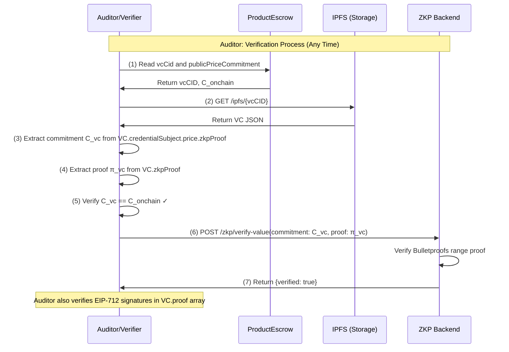

```mermaid
sequenceDiagram
    participant Auditor as Auditor/Verifier
    participant Contract as ProductEscrow
    participant IPFS as IPFS (Storage)
    participant ZKPBackend as ZKP Backend

    Note over Auditor,ZKPBackend: Auditor: Verification Process (Any Time)
    Auditor->>Contract: (1) Read vcCid and publicPriceCommitment
    Contract->>Auditor: Return vcCID, C_onchain
    Auditor->>IPFS: (2) GET /ipfs/{vcCID}
    IPFS->>Auditor: Return VC JSON
    Auditor->>Auditor: (3) Extract commitment C_vc from VC.credentialSubject.price.zkpProof
    Auditor->>Auditor: (4) Extract proof π_vc from VC.zkpProof
    Auditor->>Auditor: (5) Verify C_vc == C_onchain ✓
    Auditor->>ZKPBackend: (6) POST /zkp/verify-value(commitment: C_vc, proof: π_vc)
    ZKPBackend->>ZKPBackend: Verify Bulletproofs range proof
    ZKPBackend->>Auditor: (7) Return {verified: true}
    Note over Auditor: Auditor also verifies EIP-712 signatures in VC.proof array
```

