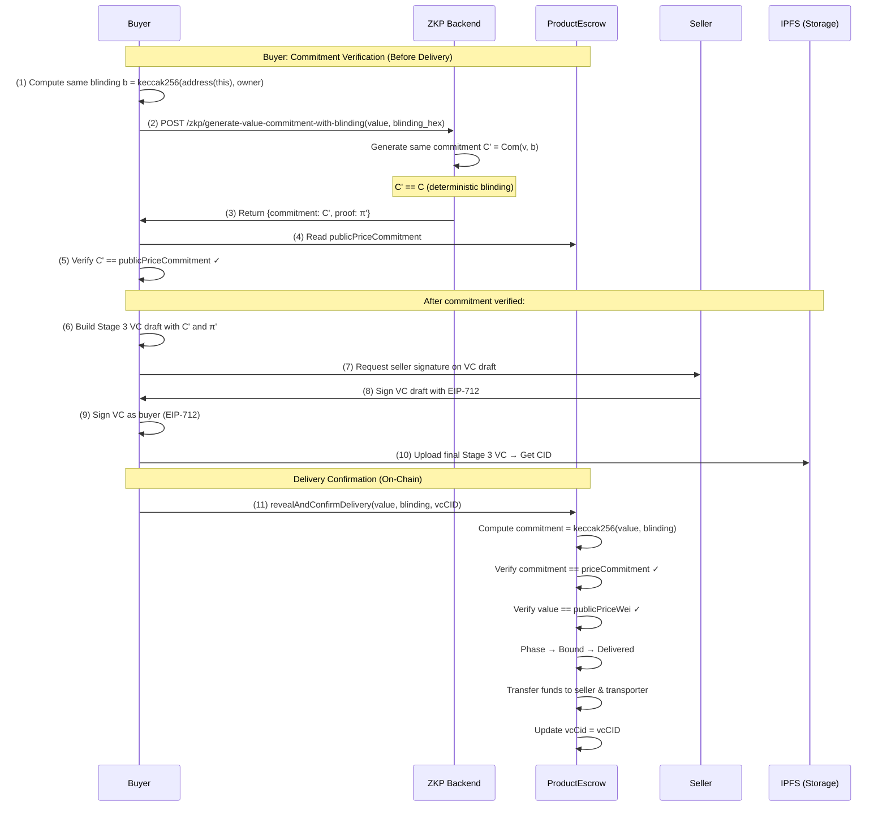

```mermaid
sequenceDiagram
    participant Buyer
    participant ZKPBackend as ZKP Backend
    participant Contract as ProductEscrow
    participant Seller
    participant IPFS as IPFS (Storage)

    Note over Buyer,Contract: Buyer: Commitment Verification (Before Delivery)
    Buyer->>Buyer: (1) Compute same blinding b = keccak256(address(this), owner)
    Buyer->>ZKPBackend: (2) POST /zkp/generate-value-commitment-with-blinding(value, blinding_hex)
    ZKPBackend->>ZKPBackend: Generate same commitment C' = Com(v, b)
    Note over ZKPBackend: C' == C (deterministic blinding)
    ZKPBackend->>Buyer: (3) Return {commitment: C', proof: π'}
    Buyer->>Contract: (4) Read publicPriceCommitment
    Buyer->>Buyer: (5) Verify C' == publicPriceCommitment ✓
    Note over Buyer,IPFS: After commitment verified:
    Buyer->>Buyer: (6) Build Stage 3 VC draft with C' and π'
    Buyer->>Seller: (7) Request seller signature on VC draft
    Seller->>Buyer: (8) Sign VC draft with EIP-712
    Buyer->>Buyer: (9) Sign VC as buyer (EIP-712)
    Buyer->>IPFS: (10) Upload final Stage 3 VC → Get CID
    Note over Buyer,Contract: Delivery Confirmation (On-Chain)
    Buyer->>Contract: (11) revealAndConfirmDelivery(value, blinding, vcCID)
    Contract->>Contract: Compute commitment = keccak256(value, blinding)
    Contract->>Contract: Verify commitment == priceCommitment ✓
    Contract->>Contract: Verify value == publicPriceWei ✓
    Contract->>Contract: Phase → Bound → Delivered
    Contract->>Contract: Transfer funds to seller & transporter
    Contract->>Contract: Update vcCid = vcCID
```

