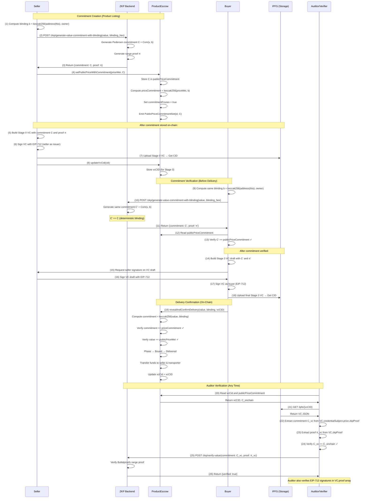

```mermaid
sequenceDiagram
    participant Seller
    participant ZKPBackend as ZKP Backend
    participant Contract as ProductEscrow
    participant Buyer
    participant IPFS as IPFS (Storage)
    participant Auditor as Auditor/Verifier

    Note over Seller,Contract: Commitment Creation (Product Listing)
    Seller->>Seller: (1) Compute blinding b = keccak256(address(this), owner)
    Seller->>ZKPBackend: (2) POST /zkp/generate-value-commitment-with-blinding(value, blinding_hex)
    ZKPBackend->>ZKPBackend: Generate Pedersen commitment C = Com(v, b)
    ZKPBackend->>ZKPBackend: Generate range proof π
    ZKPBackend->>Seller: (3) Return {commitment: C, proof: π}
    Seller->>Contract: (4) setPublicPriceWithCommitment(priceWei, C)
    Contract->>Contract: Store C in publicPriceCommitment
    Contract->>Contract: Compute priceCommitment = keccak256(priceWei, b)
    Contract->>Contract: Set commitmentFrozen = true
    Contract->>Contract: Emit PublicPriceCommitmentSet(id, C)
    Note over Seller,IPFS: After commitment stored on-chain:
    Seller->>Seller: (5) Build Stage 0 VC with commitment C and proof π
    Seller->>Seller: (6) Sign VC with EIP-712 (seller as issuer)
    Seller->>IPFS: (7) Upload Stage 0 VC → Get CID
    Seller->>Contract: (8) updateVcCid(cid)
    Contract->>Contract: Store vcCID (for Stage 0)

    Note over Buyer,Contract: Commitment Verification (Before Delivery)
    Buyer->>Buyer: (9) Compute same blinding b = keccak256(address(this), owner)
    Buyer->>ZKPBackend: (10) POST /zkp/generate-value-commitment-with-blinding(value, blinding_hex)
    ZKPBackend->>ZKPBackend: Generate same commitment C' = Com(v, b)
    Note over ZKPBackend: C' == C (deterministic blinding)
    ZKPBackend->>Buyer: (11) Return {commitment: C', proof: π'}
    Buyer->>Contract: (12) Read publicPriceCommitment
    Buyer->>Buyer: (13) Verify C' == publicPriceCommitment ✓
    Note over Buyer,IPFS: After commitment verified:
    Buyer->>Buyer: (14) Build Stage 3 VC draft with C' and π'
    Buyer->>Seller: (15) Request seller signature on VC draft
    Seller->>Buyer: (16) Sign VC draft with EIP-712
    Buyer->>Buyer: (17) Sign VC as buyer (EIP-712)
    Buyer->>IPFS: (18) Upload final Stage 3 VC → Get CID
    Note over Buyer,Contract: Delivery Confirmation (On-Chain)
    Buyer->>Contract: (19) revealAndConfirmDelivery(value, blinding, vcCID)
    Contract->>Contract: Compute commitment = keccak256(value, blinding)
    Contract->>Contract: Verify commitment == priceCommitment ✓
    Contract->>Contract: Verify value == publicPriceWei ✓
    Contract->>Contract: Phase → Bound → Delivered
    Contract->>Contract: Transfer funds to seller & transporter
    Contract->>Contract: Update vcCid = vcCID

    Note over Auditor,ZKPBackend: Auditor Verification (Any Time)
    Auditor->>Contract: (20) Read vcCid and publicPriceCommitment
    Contract->>Auditor: Return vcCID, C_onchain
    Auditor->>IPFS: (21) GET /ipfs/{vcCID}
    IPFS->>Auditor: Return VC JSON
    Auditor->>Auditor: (22) Extract commitment C_vc from VC.credentialSubject.price.zkpProof
    Auditor->>Auditor: (23) Extract proof π_vc from VC.zkpProof
    Auditor->>Auditor: (24) Verify C_vc == C_onchain ✓
    Auditor->>ZKPBackend: (25) POST /zkp/verify-value(commitment: C_vc, proof: π_vc)
    ZKPBackend->>ZKPBackend: Verify Bulletproofs range proof
    ZKPBackend->>Auditor: (26) Return {verified: true}
    Note over Auditor: Auditor also verifies EIP-712 signatures in VC.proof array
```

