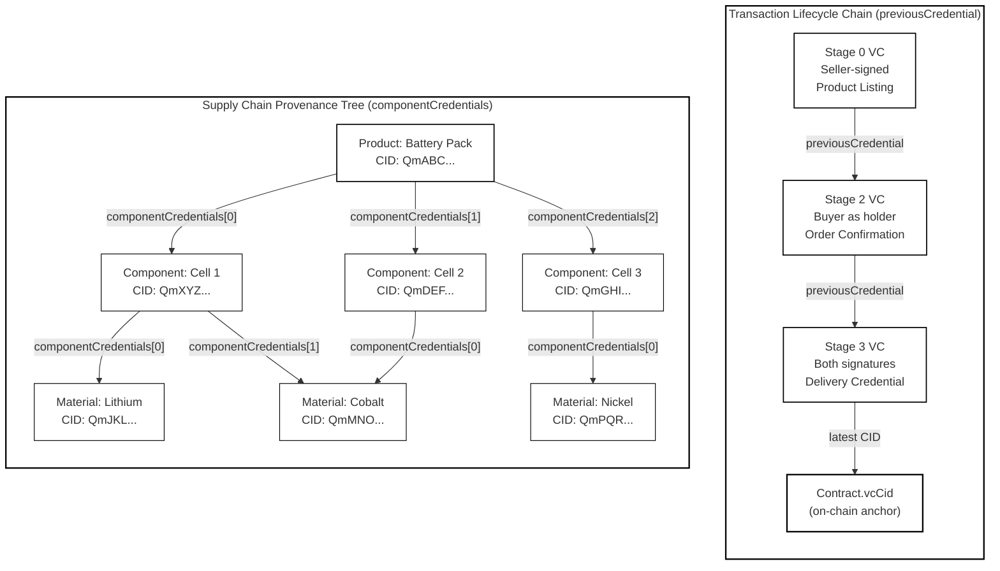

```mermaid
flowchart TD
    subgraph Linear["Transaction Lifecycle Chain (previousCredential)"]
        direction TB
        VC0["Stage 0 VC<br/>Seller-signed<br/>Product Listing"]
        VC2["Stage 2 VC<br/>Buyer as holder<br/>Order Confirmation"]
        VC3["Stage 3 VC<br/>Both signatures<br/>Delivery Credential"]
        VC0 -->|previousCredential| VC2
        VC2 -->|previousCredential| VC3
        VC3 -->|latest CID| OnChain["Contract.vcCid<br/>(on-chain anchor)"]
    end

    subgraph Tree["Supply Chain Provenance Tree (componentCredentials)"]
        direction TB
        Root["Product: Battery Pack<br/>CID: QmABC..."]
        Comp1["Component: Cell 1<br/>CID: QmXYZ..."]
        Comp2["Component: Cell 2<br/>CID: QmDEF..."]
        Comp3["Component: Cell 3<br/>CID: QmGHI..."]
        Mat1["Material: Lithium<br/>CID: QmJKL..."]
        Mat2["Material: Cobalt<br/>CID: QmMNO..."]
        Mat3["Material: Nickel<br/>CID: QmPQR..."]
        
        Root -->|"componentCredentials[0]"| Comp1
        Root -->|"componentCredentials[1]"| Comp2
        Root -->|"componentCredentials[2]"| Comp3
        Comp1 -->|"componentCredentials[0]"| Mat1
        Comp1 -->|"componentCredentials[1]"| Mat2
        Comp2 -->|"componentCredentials[0]"| Mat2
        Comp3 -->|"componentCredentials[0]"| Mat3
    end

    style Linear fill:#ffffff,stroke:#000000,stroke-width:2px
    style Tree fill:#ffffff,stroke:#000000,stroke-width:2px
    style VC0 fill:#ffffff,stroke:#000000,stroke-width:1.5px
    style VC2 fill:#ffffff,stroke:#000000,stroke-width:1.5px
    style VC3 fill:#ffffff,stroke:#000000,stroke-width:1.5px
    style OnChain fill:#ffffff,stroke:#000000,stroke-width:2px
    style Root fill:#ffffff,stroke:#000000,stroke-width:1.5px
    style Comp1 fill:#ffffff,stroke:#000000,stroke-width:1px
    style Comp2 fill:#ffffff,stroke:#000000,stroke-width:1px
    style Comp3 fill:#ffffff,stroke:#000000,stroke-width:1px
    style Mat1 fill:#ffffff,stroke:#000000,stroke-width:1px
    style Mat2 fill:#ffffff,stroke:#000000,stroke-width:1px
    style Mat3 fill:#ffffff,stroke:#000000,stroke-width:1px
```

