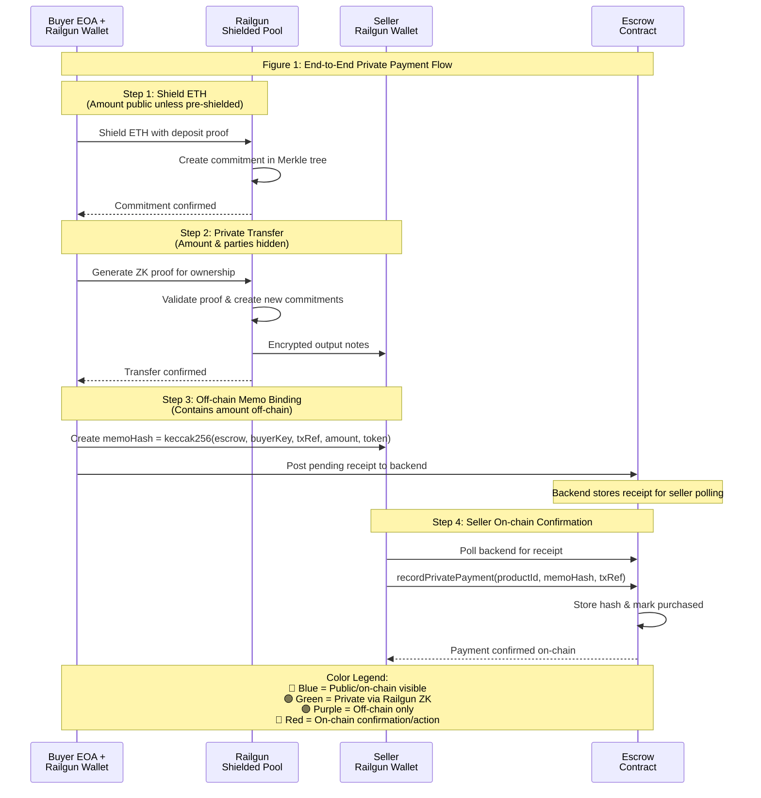

**Caption:** This sequence diagram illustrates the complete private payment flow from ETH shielding through on-chain confirmation. The color coding shows which steps are public, private, off-chain, or require on-chain action.
