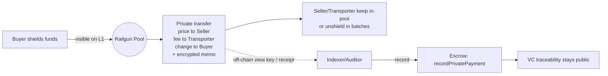

# Railgun Integration Plan & Implementation Guide

## 17.1 Overview (What You'll Build)

- Keep the current **marketplace & VC anchoring** contracts; **remove on-chain payouts**
- Perform **payments privately** inside Railgun (buyer→seller + transporter + change)
- Bind each private payment to a delivery via an **encrypted memo** (or auditor address)
- Add a small **attestation hook** on your escrow to record `PaidPrivately(productId, memoHash, txRef)`



### Key Benefits
- **Minimal code changes**: Keep 90% of existing contract logic
- **Production-ready**: Railgun is live on mainnet with significant TVL
- **Gradual migration**: Can be implemented incrementally
- **Audit-friendly**: Maintains traceability while hiding amounts

---

## 17.2 Smart Contract Changes (Minimal)

### New/Modified Solidity (L1 Escrow)

**New Events & Storage:**
```solidity
// New events for private payment tracking
event PaidPrivately(uint256 indexed productId, bytes32 memoHash, bytes32 railgunTxRef);
event PaymentPending(uint256 indexed productId, bytes32 memoHash);

// New storage for audit linking
mapping(uint256 => bytes32) public productMemoHashes;
mapping(uint256 => bytes32) public productRailgunTxRefs;
mapping(uint256 => bool) public paymentRecorded;
```

**New Functions:**
```solidity
function recordPrivatePayment(uint256 productId, bytes32 memoHash, bytes32 railgunTxRef) external {
    require(phase == Phase.Delivered, "Not delivered");
    require(!paymentRecorded[productId], "Payment already recorded");
    require(msg.sender == buyer || msg.sender == owner || msg.sender == authorizedAuditor, "Unauthorized");
    
    productMemoHashes[productId] = memoHash;
    productRailgunTxRefs[productId] = railgunTxRef;
    paymentRecorded[productId] = true;
    
    emit PaidPrivately(productId, memoHash, railgunTxRef);
}

// Optional: Add view function for audit verification
function getPaymentRecord(uint256 productId) external view returns (
    bytes32 memoHash, 
    bytes32 railgunTxRef, 
    bool recorded
) {
    return (
        productMemoHashes[productId],
        productRailgunTxRefs[productId], 
        paymentRecorded[productId]
    );
}
```

**Modified Functions:**
```solidity
// Remove ETH transfers from revealAndConfirmDelivery
function revealAndConfirmDelivery(uint revealedValue, bytes32 blinding, string memory vcCID) public {
    // ✅ Keep existing validation logic
    bytes32 computed = keccak256(abi.encodePacked(revealedValue, blinding));
    require(computed == priceCommitment, "Reveal invalid");
    
    // ✅ Keep VC anchoring
    vcCid = vcCID;
    emit VcUpdated(vcCID);
    
    // ❌ Remove direct ETH transfers
    // (bool sentSeller, ) = owner.call{value: price}("");
    // (bool sentTransporter, ) = transporter.call{value: deliveryFee}("");
    
    // ✅ Mark as delivered (payment will be recorded separately)
    delivered = true;
    phase = Phase.Delivered;
    emit DeliveryConfirmed(buyer, transporter, priceCommitment, vcCID);
}
```

### Implementation Checklist
- [ ] Add event + storage for `memoHash` and `railgunTxRef` per `productId`
- [ ] Add `recordPrivatePayment(...)` with access rules (buyer/seller/arbiter)
- [ ] Remove ERC-20 transfers from settlement paths
- [ ] Add view functions for audit verification
- [ ] Unit tests for state transitions without on-chain payouts
- [ ] Integration tests with Railgun SDK

---

## 17.3 Client Integration (SDK)

### Setup & Configuration
```javascript
// Initialize Railgun SDK
import { RailgunEngine, RailgunWallet } from '@railgun-community/engine';

const engine = new RailgunEngine();
await engine.start();

// Generate 0zk addresses for all parties
const buyerWallet = await RailgunWallet.create(buyerPrivateKey);
const sellerWallet = await RailgunWallet.create(sellerPrivateKey);
const transporterWallet = await RailgunWallet.create(transporterPrivateKey);
```

### Payment Flow Implementation
```javascript
// 1. Shield buyer's funds
const shieldTx = await buyerWallet.shield({
    tokenAddress: USDC_ADDRESS,
    amount: productPrice + deliveryFee,
    recipient: buyerWallet.getAddress()
});

// 2. Build private transfer with memo
const memo = keccak256(abi.encodePacked(productId, vcHash, nonce));
const privateTransfer = await buyerWallet.createPrivateTransfer({
    outputs: [
        { recipient: sellerWallet.getAddress(), amount: productPrice },
        { recipient: transporterWallet.getAddress(), amount: deliveryFee },
        { recipient: buyerWallet.getAddress(), amount: change }
    ],
    memo: memo,
    tokenAddress: USDC_ADDRESS
});

// 3. Submit via relayer
const relayerTx = await submitViaRelayer(privateTransfer);

// 4. Record payment on escrow
await escrowContract.recordPrivatePayment(productId, memo, relayerTx.hash);
```

### Frontend Integration
```javascript
// React component for Railgun payment flow
const RailgunPaymentFlow = ({ product, onComplete }) => {
    const [step, setStep] = useState('shield');
    const [txHash, setTxHash] = useState(null);
    
    const handleShield = async () => {
        // Shield funds
        setStep('transfer');
    };
    
    const handlePrivateTransfer = async () => {
        // Execute private transfer
        setStep('record');
    };
    
    const handleRecordPayment = async () => {
        // Record on escrow
        setStep('complete');
        onComplete();
    };
    
    return (
        <div>
            {step === 'shield' && <ShieldStep onComplete={handleShield} />}
            {step === 'transfer' && <TransferStep onComplete={handlePrivateTransfer} />}
            {step === 'record' && <RecordStep onComplete={handleRecordPayment} />}
            {step === 'complete' && <CompleteStep txHash={txHash} />}
        </div>
    );
};
```

### Implementation Checklist
- [ ] SDK initialization & key storage for 0zk addresses
- [ ] Shield flow (USDC preferred)
- [ ] Private transfer builder (multi-recipient + memo)
- [ ] Relayer configuration & fee handling
- [ ] Unshield flow with batch window UI
- [ ] Frontend screens (shield, pay privately, batch unshield)
- [ ] Error handling & retry logic
- [ ] Transaction status tracking

---

## 17.4 Relayer Setup

### Relayer Configuration
```javascript
// Configure relayer for privacy
const relayerConfig = {
    endpoint: 'https://relayer.railgun.org',
    apiKey: process.env.RAILGUN_RELAYER_KEY,
    feeToken: USDC_ADDRESS,
    maxFee: ethers.parseUnits('10', 6), // 10 USDC max fee
    retryAttempts: 3,
    retryDelay: 2000
};

// Fee estimation
const estimateRelayerFee = async (transfer) => {
    const response = await fetch(`${relayerConfig.endpoint}/estimate`, {
        method: 'POST',
        headers: { 'Authorization': `Bearer ${relayerConfig.apiKey}` },
        body: JSON.stringify(transfer)
    });
    return response.json();
};
```

### Implementation Checklist
- [ ] Relayer endpoint & API key/secrets
- [ ] Fee estimation & payer selection
- [ ] Retry/queue logic in client
- [ ] Rate limiting & error handling
- [ ] Monitoring & alerting

---

## 17.5 Indexer / Attestation Service

### Memo Decoding Service
```javascript
// Service to watch Railgun events and decode memos
class RailgunIndexer {
    constructor(escrowContract, auditorWallet) {
        this.escrowContract = escrowContract;
        this.auditorWallet = auditorWallet;
    }
    
    async watchRailgunEvents() {
        // Listen to Railgun pool events
        this.railgunProvider.on('Transfer', async (event) => {
            const memo = await this.decodeMemo(event);
            if (memo) {
                const { productId, vcHash } = this.parseMemo(memo);
                await this.recordPayment(productId, memo, event.transactionHash);
            }
        });
    }
    
    async recordPayment(productId, memoHash, txRef) {
        try {
            const tx = await this.escrowContract.recordPrivatePayment(
                productId, 
                memoHash, 
                txRef,
                { from: this.auditorWallet.address }
            );
            console.log(`Payment recorded for product ${productId}: ${tx.hash}`);
        } catch (error) {
            console.error(`Failed to record payment for product ${productId}:`, error);
        }
    }
}
```

### Receipt Storage
```javascript
// Database schema for payment receipts
const receiptSchema = {
    productId: String,
    vcHash: String,
    memoHash: String,
    railgunTxRef: String,
    timestamp: Date,
    amount: Number, // Optional: if disclosed
    status: String, // 'pending', 'recorded', 'verified'
    auditTrail: Array // Array of verification steps
};
```

### Implementation Checklist
- [ ] Choose memo binding scheme (receiver-confirms vs auditor 0zk)
- [ ] Implement memo decode + receipt storage
- [ ] Auto-call `recordPrivatePayment` on match
- [ ] Reconciliation dashboards / CSV export for thesis data
- [ ] Audit trail logging
- [ ] Monitoring & alerting for failed recordings

---

## 17.6 Privacy Hygiene Automation

### Batch Scheduler
```javascript
// Automated batch unshield scheduler
class BatchUnshieldScheduler {
    constructor(railgunWallets, schedule = '12h') {
        this.wallets = railgunWallets;
        this.schedule = schedule;
        this.batchSize = 5; // Unshield 5 transactions per batch
    }
    
    async startScheduler() {
        setInterval(async () => {
            await this.processBatch();
        }, this.parseSchedule(this.schedule));
    }
    
    async processBatch() {
        const pendingUnshields = await this.getPendingUnshields();
        if (pendingUnshields.length >= this.batchSize) {
            await this.executeBatchUnshield(pendingUnshields.slice(0, this.batchSize));
        }
    }
    
    async executeBatchUnshield(unshields) {
        // Execute unshields with randomized delays
        for (const unshield of unshields) {
            const delay = Math.random() * 30000; // 0-30 second delay
            setTimeout(() => this.executeUnshield(unshield), delay);
        }
    }
}
```

### Denomination Policy
```javascript
// Round denominations to reduce correlation
const roundDenomination = (amount) => {
    const denominations = [100, 250, 500, 1000, 2500, 5000, 10000]; // USDC
    const rounded = denominations.find(d => d >= amount) || amount;
    return rounded;
};

// Keep change in pool to avoid small withdrawals
const shouldKeepChange = (change) => {
    return change < 50; // Keep change if less than 50 USDC
};
```

### Implementation Checklist
- [ ] Batch scheduler (cron/worker)
- [ ] Exit denomination policy
- [ ] Randomized delays around delivery events
- [ ] Change management strategy
- [ ] Decoy transaction generation (optional)

---

## 17.7 Testing & Measurement (For Thesis)

### Functional Testing
```javascript
// End-to-end test suite
describe('Railgun Integration', () => {
    it('should complete full payment flow', async () => {
        // 1. Create product
        const product = await createProduct();
        
        // 2. Shield funds
        const shieldTx = await shieldFunds(buyer, product.price);
        
        // 3. Execute private transfer
        const transferTx = await executePrivateTransfer(product);
        
        // 4. Record payment
        const recordTx = await recordPayment(product.id, transferTx.memo);
        
        // 5. Verify state
        expect(await product.contract.paymentRecorded(product.id)).to.be.true;
    });
    
    it('should maintain privacy under correlation attacks', async () => {
        // Test timing correlation
        const correlationResults = await testTimingCorrelation();
        expect(correlationResults.successRate).to.be.below(0.1); // <10% success
        
        // Test amount correlation
        const amountResults = await testAmountCorrelation();
        expect(amountResults.successRate).to.be.below(0.05); // <5% success
    });
});
```

### Performance Measurement
```javascript
// Metrics collection
const metrics = {
    gasCosts: {
        shield: [],
        unshield: [],
        recordPayment: []
    },
    latencies: {
        shield: [],
        privateTransfer: [],
        unshield: []
    },
    fees: {
        relayer: [],
        proof: []
    }
};

const recordMetric = (category, operation, value) => {
    metrics[category][operation].push({
        value,
        timestamp: Date.now(),
        txHash: currentTxHash
    });
};
```

### Implementation Checklist
- [ ] E2E test vectors (10–50 runs per workload)
- [ ] Correlation experiment scripts
- [ ] Metrics capture to CSV (gas, fees, latency)
- [ ] Privacy analysis tools
- [ ] Performance benchmarking
- [ ] Stress testing with multiple concurrent transactions

---

## 17.8 Deliverables

### Code Deliverables
- [ ] Updated Solidity escrow (no on-chain payouts) + migration script
- [ ] Client app with **shield / private pay / batch unshield** flows
- [ ] Relayer config & Indexer/attestation service
- [ ] Test suite with privacy validation
- [ ] Monitoring & alerting infrastructure

### Documentation Deliverables
- [ ] Implementation guide with code examples
- [ ] Privacy analysis report
- [ ] Performance benchmarks
- [ ] Migration guide from current system

### Thesis Deliverables
- [ ] Measurement notebook (CSV → charts for thesis)
- [ ] Privacy hygiene & correlation results
- [ ] Comparison to Aztec and CFT sections
- [ ] Cost-benefit analysis
- [ ] Recommendations for production deployment

---

## 17.9 Timeline & Milestones

### Week 1-2: Smart Contract Changes
- [ ] Implement `recordPrivatePayment` function
- [ ] Remove on-chain payouts
- [ ] Add comprehensive tests
- [ ] Deploy to testnet

### Week 3-4: Client Integration
- [ ] Integrate Railgun SDK
- [ ] Implement shield/transfer/unshield flows
- [ ] Build frontend components
- [ ] Test with real transactions

### Week 5-6: Infrastructure & Testing
- [ ] Set up relayer & indexer
- [ ] Implement privacy hygiene automation
- [ ] Run correlation experiments
- [ ] Collect performance metrics

### Week 7-8: Analysis & Documentation
- [ ] Analyze privacy results
- [ ] Create thesis deliverables
- [ ] Write implementation documentation
- [ ] Prepare presentation materials

---

## 17.10 Risk Mitigation

### Technical Risks
- **Railgun SDK issues**: Have fallback to manual transaction building
- **Relayer failures**: Implement retry logic and multiple relayer options
- **Gas price spikes**: Implement dynamic fee adjustment

### Privacy Risks
- **Timing correlation**: Implement randomized delays and batching
- **Amount correlation**: Use denomination rounding and change management
- **Network analysis**: Use multiple relayers and VPNs for testing

### Operational Risks
- **Key management**: Implement secure key storage and backup procedures
- **Monitoring**: Set up comprehensive logging and alerting
- **Recovery**: Plan for rollback procedures if issues arise 