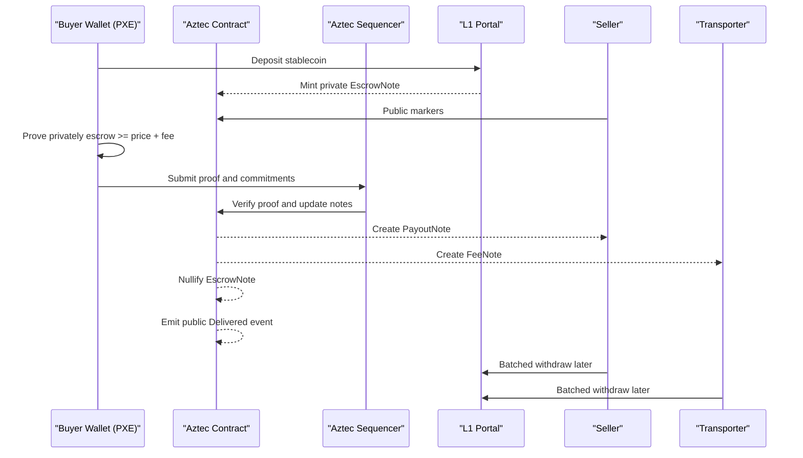
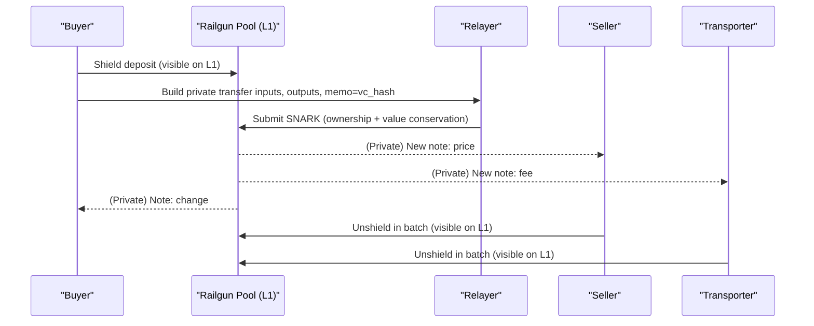
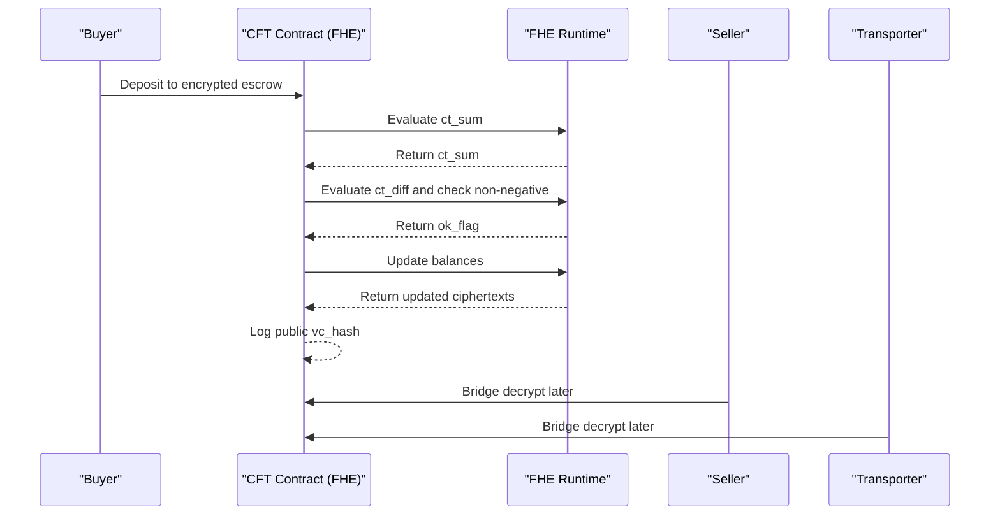

# Value Privacy for EV-Battery Marketplace — Technical Comparison

**Scope:** Compare three approaches to keep **amounts/prices** private while preserving **traceability via Verifiable Credentials (VCs)**:
- **Aztec (privacy L2, ZK)**
- **Railgun (L1 shielded pool, ZK)**  
- **CFT – Confidential Fungible Token (FHE-enabled EVM)**

---

## 1. Technology Overview

### Aztec (Privacy L2)
A privacy-first L2 that combines **private note-based state** with optional **public state**. Users execute private functions locally in a **PXE (Private eXecution Environment)** and submit ZK proofs; L1 sees commitments/nullifiers and chosen public markers.

### Railgun (L1 Shielded Pool)
An Ethereum **shielded pool**. Deposits ("shield") create private notes inside a shared Merkle tree; private transfers occur inside the pool; withdrawals ("unshield") exit to public L1.

### CFT (FHE)
An ERC-20-like **Confidential Fungible Token** where balances/amounts are **ciphertexts**. Confidentiality provided by an **FHE coprocessor/L2** (e.g., fhEVM). Not ZK by default.

---

## 2. Conceptual Explanations

### Aztec — "Sealed Envelopes on a Side Street"
Think of Aztec as a **private side street** next to Ethereum. You put money into a **sealed envelope** (private note) and show a **math certificate** (ZK proof) that says *"I have enough to pay the seller and transporter."* The clerk accepts the certificate without opening your envelope, then creates new sealed envelopes for the seller and transporter. People on the public road only see that **some sealed envelopes moved**, not what's inside.

**Key idea:** Prove rules are followed **without revealing numbers**. Public milestones can still be announced.

### Railgun — "Private Cash Vault"
Railgun is like a **shared private vault**. You **deposit** cash (everyone sees the amount). Inside, the vault allows **private swaps**: you split your cash into envelopes for the seller, transporter, and your change. The vault's guard checks the math **without seeing amounts**. When someone **withdraws**, that amount becomes public again.

**Key idea:** Keep payments **inside** the vault to stay private; deposits/withdrawals are the only public edges.

### CFT / FHE — "Locked Calculators"
A CFT runs on a network with **locked calculators**. Your numbers are put into the calculator **locked** (encrypted). The calculator can **add and subtract** while locked and tell if the result is non-negative—**without ever unlocking them**. So the contract can check you have enough escrow and update balances, but no one sees the amounts.

**Key idea:** Do the math **on encrypted numbers**; trust comes from the network that runs the locked calculators.

---

## 3. Privacy & Security Comparison

| Dimension | **Aztec (L2, ZK)** | **Railgun (L1, ZK)** | **CFT / FHE (L2/Sidechain)** |
|-----------|-------------------|---------------------|------------------------------|
| **Amounts** | Private on L2 (encrypted notes) | Private inside the pool | Private (ciphertexts) |
| **Counterparties** | Private on L2 (unless public markers) | Private inside pool | Private at contract level |
| **Transaction graph** | Hidden inside L2; L1 shows batched commitments | Hidden inside pool; L1 shows shields/unshields | Hidden within FHE runtime |
| **On/Off-ramp linkability** | Possible via timing/size; mitigated by batching | Same (shield/unshield) | Similar (bridge in/out) |

### Trust Assumptions

| Area | **Aztec** | **Railgun** | **CFT (FHE)** |
|------|-----------|-------------|---------------|
| **Privacy/integrity** | ZK validity proofs; note/nullifier model | ZK-SNARKs with shared anonymity set | FHE runtime executes on ciphertexts |
| **Extra trust** | Rollup assumptions (sequencer liveness) | None beyond protocol | FHE key-mgmt and attestation |
| **Verification** | Rollup proof verified on L1 | Verifier contracts on L1 | FHE chain/coprocessor verification |

---

## 4. Cost & Performance

| Aspect | **Aztec** | **Railgun** | **CFT (FHE)** |
|--------|-----------|-------------|---------------|
| **User proving cost** | Local proving in PXE; L2 fees for inclusion | Proof handled by protocol; costs at shield/unshield | FHE computation offloaded to coprocessor |
| **Gas sensitivity** | Moderate (L2 data + L1 posts) | High for L1 shields/unshields; low for internal transfers | Depends on FHE chain; base L1 sees bridge ops |
| **Latency** | L2 block cadence + L1 settlement | Immediate inside pool; L1 finality for shields/unshields | FHE network finality + bridge timing |

---

## 5. End-to-End Settlement Flows

### 5.1 Aztec (Privacy L2 with ZK)

**Flow:** Buyer bridges funds → creates private proof that `escrow ≥ price + fee` → Aztec updates private notes → optional public event → batched withdrawals.



### 5.2 Railgun (L1 Shielded Pool with ZK)

**Flow:** Buyer shields funds → performs private transfer with outputs to Seller, Transporter, and Buyer (change) → parties unshield in batches.



### 5.3 CFT / FHE Token (FHE-enabled EVM)

**Flow:** Contract stores encrypted balances and escrow → performs arithmetic on ciphertexts → updates encrypted balances → logs VC anchor.



---

## 6. Implementation Patterns

### 6.1 Confidential Settlement with `escrow ≥ price + fee`

**Notation:** `hashPoseidon(·)` is ZK-friendly hash; `HE.add/sub/is_nonnegative` are FHE ops; `ct_*` are ciphertexts.

#### Aztec (ZK, hybrid private/public)
```text
// Public inputs: productId, deadline, vc_hash
// Private witnesses: escrow_amount, price, fee, secrets..., vc_data

// Constraints (proved locally in PXE)
assert price >= 0
assert fee >= 0
assert escrow_amount >= price + fee
assert hashPoseidon(vc_data) == vc_hash

// State transitions (private):
nullify(escrow_note(productId, buyer, escrow_amount))
mint_note(seller, amount = price, tag = productId)
mint_note(transporter, amount = fee, tag = productId)
mint_note(buyer, amount = escrow_amount - price - fee, tag = productId)

// Public markers (optional for traceability):
emit PublicEvent { productId, phase: Delivered, deadline }
```

#### Railgun (ZK, L1 shielded pool)
```text
// Inputs: hidden notes owned by buyer, sum_in >= price + fee
inputs = [note_i(amount_i, owner=buyer)]
outputs = [
  note_seller(price),
  note_transporter(fee),
  note_change(sum_in - price - fee, owner=buyer)
]

// Proof to pool verifier:
prove {
  forall note_i in inputs: merkle_membership(note_i) && spend_authorized(note_i)
  sum(amount_i for inputs) == sum(amount_j for outputs)
  token(inputs) == token(outputs)
  memo_hash == vc_hash
}

submit_to_pool(inputs, outputs, memo_hash)
```

#### CFT / FHE token (Solidity on FHE-enabled chain)
```text
// State: ciphertext balances and escrow values
ct_bal[buyer], ct_bal[seller], ct_bal[transporter]
ct_escrow[productId]

// Public anchor (traceability): vc_hash
// Private inputs as ciphertexts: ct_price, ct_fee

// Encrypted computation:
ct_sum = HE.add(ct_price, ct_fee)
ct_diff = HE.sub(ct_escrow[productId], ct_sum)

require(HE.is_nonnegative(ct_diff))

// Apply encrypted state updates:
ct_bal[buyer] = HE.sub(ct_bal[buyer], ct_sum)
ct_bal[seller] = HE.add(ct_bal[seller], ct_price)
ct_bal[transporter] = HE.add(ct_bal[transporter], ct_fee)

logTrace(productId, vc_hash)
```

### 6.2 VC Traceability Binding Pattern

- Include `vc_hash` as **public parameter** and **bind privately**:
  - **Aztec:** prove `hashPoseidon(vc_data) == vc_hash` in private circuit
  - **Railgun:** place `vc_hash` in memo or commit into output notes
  - **CFT/FHE:** store `Enc(vc_id)` alongside transfer or log `vc_hash`
- Keep deadlines and phase markers **public**; keep amounts and counterparties **private**
- Batch operations to reduce edge correlation

---

## 7. Migration Mapping — From Current Solidity Escrow

Based on your described contracts (`ProductFactory.sol`, `ProductEscrow.sol`, `Escrow.sol`) with phases (Listed → Funded → Bound → Delivery → Delivered/Cancelled/Expired), price commitments, transporter fees, and VC anchors.

### 7.1 Current Contract Surface (Typical Functions & Events)

**Functions (typical names; adapt to your exact signatures):**
- `listProduct(productId, priceCommitment, deadline, ... )`
- `deposit(productId, token, amount)`
- `setTransporter(productId, transporter, fee, [deposit])`
- `revealAndConfirmDelivery(productId, price, salt, vcData)`
- `timeout(productId)` / `cancel(productId)`
- `withdrawSeller(productId)` / `withdrawTransporter(productId)` / `refundBuyer(productId)`

**Events:**
- `Listed(productId, seller, deadline)`
- `Funded(productId, buyer, amount)`
- `Bound(productId, transporter)`
- `Delivered(productId, vcHash)`
- `Cancelled(productId)` / `Expired(productId)`
- `Withdrawn(productId, to, amount)`

These will be **kept as public traceability anchors** (possibly on a small L1 "anchor" contract) while value privacy moves to Aztec/Railgun/CFT.

### 7.2 Railgun (L1 Shielded Pool) — **Reuse with Light Changes**

**Keep (as-is or minor tweaks):**
- `listProduct`, `setTransporter`, `timeout/cancel`, phase tracking, and **all VC events**
- Keep `priceCommitment` (or `vcHash`) fields for binding settlement

**Remove/disable:**
- Any **token custody** or direct `transferFrom` to seller/transporter in `revealAndConfirmDelivery` or `withdraw*` functions
- Internal balance accounting in escrow (balances are held in Railgun, not the escrow)

**Modify / add:**
- Add `recordPrivatePayment(productId, railgunMemoHash, poolTxRef)` — callable by buyer/seller to attest that a Railgun private transfer was made. Emit `PaidPrivately(productId, railgunMemoHash)`
- Change `revealAndConfirmDelivery(...)` to **only validate** price preimage & VC binding, then move to Delivered **without** paying out on-chain
- Optional: `markPaidViaRailgun(productId, commitmentHash)` to be called by an off-chain indexer/arbiter after it sees a matching memo in the pool
- Store `railgunMemoHash`/`commitmentHash` in state for audit linking

**Client-side integration (new):**
- Use Railgun SDK to **shield** → **private transfer** (outputs: seller price, transporter fee, buyer change; memo = `hash(productId||vcHash)` ) → **batch unshield** later

**Security note:** On-chain escrow can't natively verify the Railgun transfer; treat it as **off-chain attested settlement** bound to the `railgunMemoHash` and VC anchor.

### 7.3 Aztec (Privacy L2) — **Rebuild Private Logic in Aztec.nr/Noir**

**New Aztec contract (private + public functions):**
- `open_product_public(productId, deadline, vcHash)` → emits **public** traceability event on Aztec (or mirrored on L1 via bridge)
- `deposit_private(productId, amount)` → mints `EscrowNote` for buyer (private)
- `bind_transporter_private(productId, transporter, fee)` → optional private fee/bid note
- `confirm_delivery_private(productId, price, fee, vcData)` → **proves**: `escrow ≥ price + fee` and `Poseidon(vcData) == vcHash`; **mints** `PayoutNote(seller, price)`, `FeeNote(transporter, fee)`, returns change; **nullifies** escrow
- `timeout_refund_private(productId)`

**Public markers (for traceability):**
- `mark_bound_public(productId, transporter)`; `mark_delivered_public(productId, vcHash)`

**L1 anchor (small Solidity, optional):**
- Mirror `Listed/Delivered/Cancelled/Expired` events with `productId, vcHash, deadline` for the EU battery passport anchoring

**Frontend changes:**
- Replace EVM calls with **aztec.js + PXE** flows (simulate → prove → send)
- Add **Portal** deposit/withdraw screens; implement batched withdrawals to reduce correlation

**What is not reused:** your Solidity escrow logic for amounts; it becomes **Aztec.nr** code with Noir circuits.

### 7.4 CFT / FHE (OpenZeppelin Confidential Token) — **Solidity Refactor**

**Keep:**
- Contract structure, roles, product phases, and **VC anchoring events**
- Function names and flow can stay similar for readability

**Refactor (major):**
- Replace ERC-20 with **OpenZeppelin Confidential Fungible Token** as the settlement asset
- Store amounts/escrow as **ciphertexts** in state
- Swap arithmetic and checks for FHE ops: `HE.add`, `HE.sub`, and `HE.isNonNegative(escrow - (price+fee))`
- Update settlement functions (e.g., `confirmDelivery`) to **operate on ciphertext balances**, not plaintext
- Add **view/disclosure** hooks if supported (auditor/regulator access)

**Deployment:**
- Deploy on an **FHE-enabled chain** (e.g., fhEVM/Inco). Use bridges for any L1 anchoring if needed.

### 7.5 Cross-cutting Changes and New Helpers

- **Memo / binding helper:** Standardize `memo = keccak(productId || vcHash || nonce)` for Railgun & Aztec (as a public parameter) so off-chain tools can link payments to deliveries without revealing values
- **Batching scheduler:** A small off-chain job to trigger **batched withdrawals** (Aztec Portal) and **batched unshields** (Railgun) on fixed intervals
- **Receipts:** Off-chain receipt object `{productId, vcHash, memo, txRef, proof?}` stored in your indexer for audits
- **Stablecoin support:** Prefer a stablecoin settlement asset to avoid price-inference via ETH volatility

### 7.6 Checklist by Method

**Railgun**
- [ ] Remove on-chain token payouts
- [ ] Add `PaidPrivately(productId, railgunMemoHash)` event + storage
- [ ] Frontend: shield → private transfer (with fee split + memo) → batch unshield
- [ ] Indexer: watch pool memos to confirm settlement

**Aztec**
- [ ] New Aztec.nr contract (private deposit/settle/timeout)
- [ ] Noir circuits: budget (`escrow ≥ price + fee`) + VC preimage bind
- [ ] Public markers for phases & deadlines
- [ ] Portal deposit/withdraw UX and batching

**CFT / FHE**
- [ ] Swap ERC-20 → Confidential Fungible Token
- [ ] Replace amount math with FHE API calls
- [ ] Add policy-based view/disclosure if available
- [ ] Deploy to FHE chain; bridge anchors if needed

---

## 8. Risk Mitigation

### Correlation Leakage Points & Mitigation

- **Aztec:** Deposits/withdrawals on L1 can tie to events → **Batch** on schedules; randomize timings/amounts; keep funds inside L2 longer
- **Railgun:** Shields/unshields are public → **Batch exits**, use fixed denominations, keep flows inside the pool  
- **CFT (FHE):** Bridges to/from FHE chain are visible → **Batch bridges**, use scheduled settlement windows, avoid 1:1 event timing

### Failure Modes

- **Aztec:** Production-readiness timelines; on/off-ramp correlation if not batched; new tooling (Noir/Aztec.nr) to learn
- **Railgun:** Privacy depends on **anonymity set** and user hygiene; edge correlation at shields/unshields; regulatory perception varies
- **CFT (FHE):** Security relies on FHE coprocessor/attestation and key management; younger ecosystem; portability to Ethereum L1 is indirect

---

## 9. Decision Framework

### Evaluation Rubric

Assign 0–10 scores; multiply by weights; sum for comparative score.

| Criterion | **Weight** | **Aztec** | **Railgun** | **CFT (FHE)** |
|-----------|------------|-----------|-------------|---------------|
| Amount privacy & linkability resistance | 0.40 |  |  |  |
| Cost per settlement (gas/fees + proving) | 0.20 |  |  |  |
| Latency to finality | 0.15 |  |  |  |
| Dev & ops complexity (time-to-integrate) | 0.15 |  |  |  |
| Auditability / selective disclosure | 0.10 |  |  |  |
| **Weighted total** | **1.00** |  |  |  |

### Theoretical Recommendations

- **Aztec:** Best fit for **pure-crypto amount privacy + composable private logic** in marketplace with public VC traceability
- **Railgun:** Most **pragmatic, production-now** path on Ethereum L1; edge leakage at ingress/egress must be managed
- **CFT (FHE):** Strong **alternative architecture** with Solidity ergonomics if accepting FHE trust assumptions

---

## 10. Abstract Models

**Aztec (privacy L2, ZK):** Private notes + nullifiers. Users prove locally that contract constraints hold; chain sees only commitments/nullifiers and chosen public markers.

**Railgun (L1 shielded pool, ZK):** Shared UTXO-like pool. Users prove ownership and value conservation for hidden inputs/outputs; verifier updates Merkle tree; shields/unshields are public.

**CFT / FHE token:** Balances and amounts are ciphertexts. Nodes evaluate functions on ciphertexts (FHE); correctness relies on FHE runtime/attestation; optional view/decrypt policies. 