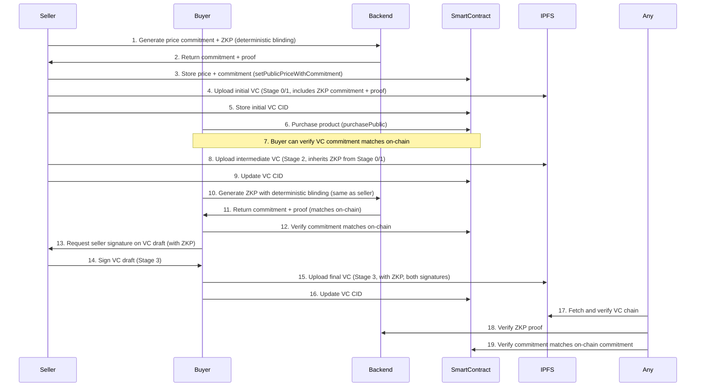
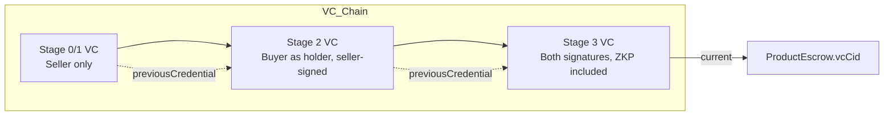
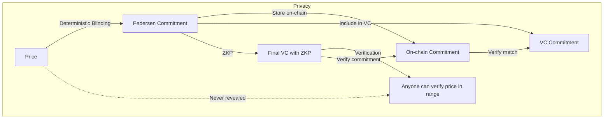

# ⚡️ EV Battery Supply Chain dApp — ZKP & VC Architecture

> **See also:**
> - [ZKP Technical Background](./zkp-technical-background.md) - Comprehensive background on ZKPs, Pedersen Commitments, and Bulletproofs
> - [ZKP Security Enhancements Analysis](./zkp-security-enhancements-analysis.md) - Analysis of proposed security improvements
> - [ZKP & Privacy Summary](./zkp-privacy-summary.md) - Overview of ZKP implementation and privacy features

## Workflow Overview

---

## VC Chain Structure

---

## Privacy with ZKP

---

## How ZKP is Used

- **Deterministic Blinding:** The blinding factor is computed from `keccak256(solidityPacked(['address', 'address'], [productAddress, sellerAddress]))`, ensuring seller and buyer generate the same commitment.
- **Seller Flow:** At product creation, seller generates a Pedersen commitment using deterministic blinding, stores it on-chain via `setPublicPriceWithCommitment()`, and includes the ZKP proof in the initial VC (Stage 0/1).
- **Buyer Flow:** At delivery confirmation, buyer generates the same commitment using the same deterministic blinding, verifies it matches the on-chain commitment, and includes the ZKP proof in the final VC (Stage 3).
- **On-Chain Binding:** The commitment is stored on-chain as `publicPriceCommitment` (bytes32), providing an immutable anchor for verification.
- **ZKP (Bulletproofs):** Both seller and buyer generate ZKPs using deterministic blinding to prove the price is in an allowed range (0 < price < 2^64), without revealing it.
- **VC Inclusion:** The ZKP and commitment are included in both the initial VC (Stage 0/1, seller-signed) and the final VC (Stage 3, both seller and buyer signed).
- **Verification Process:**
  1. **ZKP Verification:** Verify the proof against the commitment using `/zkp/verify-value` endpoint
  2. **Signature Verification:** Verify EIP-712 signatures of seller and buyer
  3. **Commitment Integrity:** Verify that `vc.credentialSubject.price.zkpProof.commitment === contract.publicPriceCommitment()`
  4. **Result:** Anyone can verify the price is in range and the commitment is authentic, but cannot learn the actual price

---

## Auditability

- **VC chain is stored on IPFS, anchored on-chain via the latest CID.**
- **Each VC is signed (W3C-compliant `proof` array).**
- **ZKP is included in the final VC.**
- **Commitment is stored on-chain and can be verified against the VC commitment.**
- **Anyone can walk the VC chain, verify signatures, check the ZKP, and verify commitment integrity.**

> **📖 For detailed audit instructions, see the [Auditor Guide](./AUDITOR_GUIDE.md)**

---

## Summary Table

| Stage         | VC Uploaded? | CID On-Chain? | Commitment On-Chain? | ZKP Included? | Signatures         |
|---------------|:-----------:|:-------------:|:-------------------:|:-------------:|:------------------:|
| Initial (0/1) |     Yes     |     Yes       |        Yes          |      No       | Seller             |
| Stage 2       |     Yes     |     Yes       |        Yes          |      No       | Seller             |
| Final (3)     |     Yes     |     Yes       |        Yes          |     Yes       | Seller + Buyer     |

---

**This architecture provides:**
- **Confidentiality:** Price is never revealed, only proven in range.
- **Integrity:** On-chain commitment binding ensures VC commitments cannot be tampered with.
- **Deterministic Commitments:** Seller and buyer generate the same commitment using deterministic blinding.
- **Auditability:** Full VC chain, signatures, ZKP, and commitment integrity are all verifiable.
- **Compliance:** Uses W3C VC standards and best practices for ZKP integration.

---

## Technical Implementation

### **ZKP Backend (Rust)**
- **Location:** `zkp-backend/src/`
- **Main Entry:** `zkp-backend/src/main.rs` (Actix-Web server)
- **ZKP Module:** `zkp-backend/src/zk/pedersen.rs`
- **Key Function:** `prove_value_commitment_with_blinding(value: u64, blinding: Scalar) -> (CompressedRistretto, Vec<u8>, bool)`
- **Library:** `bulletproofs` crate (Dalek-NG), `curve25519-dalek-ng`
- **Port:** `5010` (configurable via `REACT_APP_ZKP_BACKEND_URL`)

### **Frontend Implementation**
- **Commitment Utils:** `frontend/src/utils/commitmentUtils.js`
  - `generateDeterministicBlinding(productAddress, sellerAddress)`
  - `generateCommitmentWithDeterministicBlinding(value, productAddress, sellerAddress, zkpBackendUrl)`
  - `verifyCommitmentMatch(vcCommitment, onChainCommitment)`
- **Product Creation (Seller):** `frontend/src/components/marketplace/ProductFormStep3.jsx`
  - Generates deterministic commitment, stores on-chain, includes in VC
- **Delivery Confirmation (Buyer):** `frontend/src/components/marketplace/ProductDetail.jsx`
  - `handleRequestSellerSignature()`: Generates ZKP with deterministic blinding, verifies against on-chain commitment
- **ZKP Verification:** `frontend/src/components/vc/VerifyVCInline.js`
- **VC Builder:** `frontend/src/utils/vcBuilder.js`, `frontend/src/utils/vcBuilder.mjs`

### **Smart Contract**
- **Contract:** `contracts/ProductEscrow_Initializer.sol`
- **Storage:** `bytes32 public publicPriceCommitment;`
- **Function:** `setPublicPriceWithCommitment(uint256 priceWei, bytes32 commitment)`
- **Event:** `PublicPriceCommitmentSet(uint256 indexed id, bytes32 commitment)`
- **Access:** `onlySeller`, `whenNotStopped`, `phase == Listed`

### **API Endpoints**
- **Generate Commitment:** `POST /zkp/generate-value-commitment-with-blinding`
  - Request: `{value: u64, blinding_hex: string}`
  - Response: `{commitment: string, proof: string, verified: boolean}`
- **Verify ZKP:** `POST /zkp/verify-value`
  - Request: `{commitment: string, proof: string}`
  - Response: `{verified: boolean}`

### **VC Structure**
- **Price Field:** `credentialSubject.price` (stringified JSON)
- **ZKP Proof Location:** `credentialSubject.price.zkpProof`
- **Proof Fields:**
  - `commitment`: Hex-encoded CompressedRistretto (64 hex chars)
  - `proof`: Hex-encoded Bulletproofs proof bytes
  - `protocol`: `"bulletproofs-pedersen"`
  - `proofType`: `"zkRangeProof-v1"`

### **Verification Flow**
1. **Fetch VC:** Retrieve VC from IPFS using CID stored on-chain
2. **Extract ZKP:** Parse `credentialSubject.price.zkpProof` from VC
3. **Verify ZKP Proof:** Call `/zkp/verify-value` with commitment and proof
4. **Verify Commitment Match:** Compare VC commitment with `contract.publicPriceCommitment()`
5. **Verify Signatures:** Verify EIP-712 signatures in VC's `proof` array

### **Implementation Status**
- ✅ **Seller Flow:** Seller generates deterministic commitment, stores on-chain, includes in VC
- ✅ **Buyer Flow:** Buyer uses deterministic blinding to generate same commitment, verifies against on-chain
- ✅ **Verification:** ZKP verification and commitment matching fully implemented
- ✅ **Backend:** ZKP backend supports deterministic blinding via `/zkp/generate-value-commitment-with-blinding`
- ✅ **Contract:** `setPublicPriceWithCommitment` function implemented and tested
- ✅ **Frontend:** Commitment utilities and buyer flow integration complete 